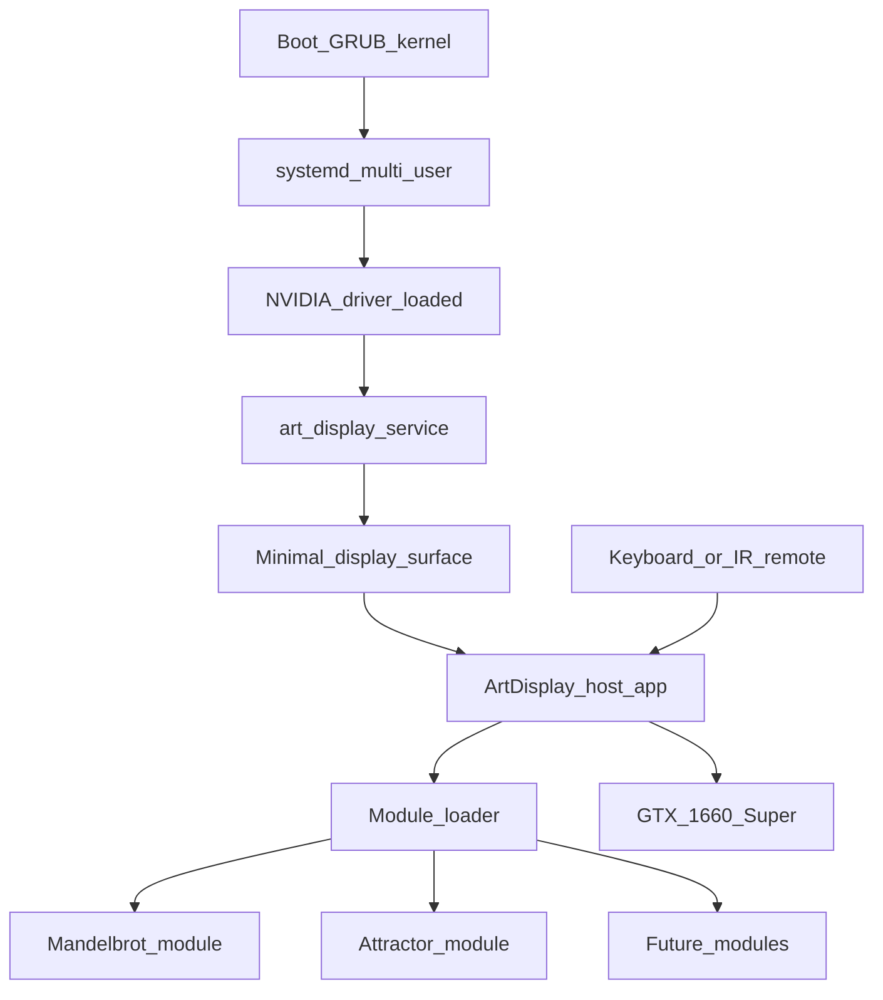
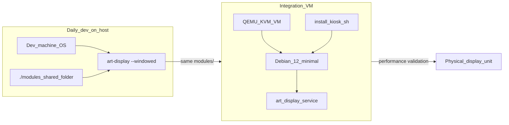

# GPU Art Display Software Stack

## Feasibility verdict

**Yes — this is a solid, well-trodden path.** A full x86 PC with a GTX 1660 Super is actually *better* than trying to embed this on a Raspberry Pi or similar: you get real GPU compute, plenty of VRAM (6 GB), mature Linux drivers, and headroom for heavy fractals, attractors, and post-processing.

| Concern | Assessment |
|---------|------------|
| Real-time GPU fractals/attractors on 1660 Super | Excellent — OpenGL 4.6 compute shaders or Vulkan compute are ideal for this workload |
| Minimal Linux that boots straight into art | Straightforward — no custom OS build required |
| Modular GPU code you can add/swap | Straightforward — plugin or shader-pack architecture |
| Keyboard/IR remote selection (no menu UI) | Simple — map keys to next/prev module inside one fullscreen process |
| Long-running kiosk reliability | Achievable with systemd service, watchdog, and optional read-only root |

The main risks are **NVIDIA driver setup on Linux** (use proprietary drivers, pin a known-good version) and **choosing one graphics API early** so your modules share a common contract.

---

## Recommended architecture



**Core idea:** one always-running fullscreen host process owns the window, input loop, and GPU context. Art pieces are **modules** loaded from disk — not separate apps — so switching art is instant and you never drop out of fullscreen.

---

## Layer 1: Minimal Linux OS

**Recommendation: start with a standard minimal distro, not a custom Buildroot image.**

Buildroot/Yocto make sense for fixed-function embedded boards. On a full PC with an NVIDIA dGPU, a minimal **Debian 12**, **Ubuntu Server minimal**, or **Arch** install is faster to maintain and easier to debug.

### What to install (and what to omit)

**Include:**
- Proprietary **NVIDIA driver** (535+ or current stable; 1660 Super is well supported)
- `mesa` is not sufficient for CUDA/compute on NVIDIA — you need the proprietary stack
- Basic networking only if you want SSH for updates/debugging
- `systemd` (already present)
- Input stack: `libinput`, optionally `lirc` for IR remotes

**Omit:**
- Desktop environment (GNOME/KDE)
- Display manager (GDM/SDDM) unless you want one
- Browser, office software, etc.

### Boot-to-art flow

1. BIOS auto-powers on (your hardware concern)
2. GRUB → kernel → systemd reaches `multi-user.target`
3. `art-display.service` starts automatically (optionally via systemd auto-login on tty1)
4. Service launches compositor + host app fullscreen
5. On crash: `Restart=always` with a short backoff

Example unit shape (to be added later in repo):

```ini
[Service]
ExecStart=/usr/local/bin/art-display
Restart=always
RestartSec=3
Environment=DISPLAY=:0
```

### Display surface options (pick one)

| Option | Pros | Cons |
|--------|------|------|
| **X11 + OpenGL fullscreen** (`xorg`, no WM) | Most predictable with NVIDIA; huge GLSL ecosystem | Older stack |
| **Wayland kiosk compositor** (e.g. Cage) | Clean, no full DE | NVIDIA Wayland support has improved but still more moving parts |
| **Direct DRM/KMS + EGL** | Smallest stack | Most custom code; harder to debug |

**Pragmatic default for v1:** **X11 + OpenGL 4.6 fullscreen host app.** It matches GLSL-heavy art workflows and avoids Wayland edge cases on NVIDIA. Revisit Wayland later if you want a cleaner compositor story.

---

## Layer 2: Host application (the runtime)

**Recommendation: Rust host + OpenGL 4.6 (via `glutin`/`sdl2`) for v1.**

Why Rust for the host:
- Safe long-running kiosk process
- Good dynamic loading (`libloading`) for native modules
- Easy CLI + config parsing
- You can still author art primarily in GLSL

Why OpenGL over Vulkan for v1:
- Your art (Mandelbrot, attractors) maps naturally to **compute shaders** or full-screen fragment passes
- GLSL tooling and examples are abundant
- Less boilerplate than Vulkan while still fully GPU-driven
- 1660 Super handles OpenGL 4.6 compute very well

Vulkan/wgpu remains a good **v2 migration** if you later want lower CPU overhead, multi-pass pipelines, or cross-GPU portability.

### Host responsibilities

- Create fullscreen GL context at native display resolution
- Discover and load modules from a directory (e.g. `/opt/art-display/modules/`)
- Run render loop at display refresh rate (or uncapped if desired)
- Handle input:
  - `Right` / `n` → next module
  - `Left` / `p` → previous module
  - `r` → reload current module (dev convenience)
  - `Esc` → optional quit (disable in production)
  - Optional: `1-9` jump to module, `+/-` tweak exposed parameters
- Hot-swap modules without restarting the process
- Log errors to journald (`stderr` → systemd journal)

---

## Layer 3: Modular art pieces (the important contract)

Use a **two-tier module system** so you can stay shader-first but still support weird/custom pieces later.

### Tier A — Shader packs (default, recommended for most art)

Each module is a folder:

```
modules/mandelbrot/
  module.toml
  main.comp          # or main.frag
  common.glsl        # optional shared code
  preview.png        # optional, ignored at runtime
```

Example `module.toml`:

```toml
name = "Mandelbrot Deep Zoom"
type = "compute"          # compute | fragment
entry = "main.comp"
workgroup = [16, 16, 1]
parameters = [
  { name = "max_iter", type = "int", default = 512, key = "Equal" },
  { name = "zoom_speed", type = "float", default = 1.0, key = "Up" }
]
```

The host:
- Compiles shaders at load time (with `#include` support for shared GLSL)
- Binds uniforms/SSBOs from a small standard UBO layout (time, resolution, frame index, params)
- Dispatches compute or draws a fullscreen triangle

**This is the fastest path for Mandelbrot, Julia sets, reaction-diffusion, attractors, raymarched scenes, etc.**

### Tier B — Native plugins (escape hatch)

For art that needs CPU-side logic (stateful simulation steps, file I/O, audio reactivity):

```
modules/my-weird-attractor/libattractor.so
modules/my-weird-attractor/module.toml
```

Native plugin C ABI (conceptual):

```c
typedef struct ArtModule {
    const char* name;
    int (*init)(const ArtHost* host);
    void (*render)(const ArtFrame* frame);
    void (*on_key)(int key);
    void (*shutdown)(void);
} ArtModule;
```

Rust or C++ can implement these; host loads with `libloading`.

**Rule of thumb:** 80% of pieces should be Tier A shader packs. Reach for Tier B only when shaders alone are awkward.

---

## Layer 4: Input (keyboard + IR remote)

Since you want **no on-screen menu**:

1. Host app reads keyboard via GLFW/SDL/libinput
2. For IR remote: **LIRC** maps remote buttons to key events
   - Example: `irexec` sends X11 key events, or a small wrapper sends signals/D-Bus to the host
3. Optionally show module name briefly as a small OSD overlay (can be disabled) — useful during setup, invisible in final install

---

## Layer 5: GPU art patterns that fit this stack

These all map cleanly to Tier A shader packs:

| Art type | GPU approach |
|----------|--------------|
| Mandelbrot / Julia | Compute shader writes float/color buffer; optional palette LUT |
| Strange attractors | Compute: iterate map per pixel or per particle; accumulate trails in texture |
| Reaction-diffusion | Multi-pass compute ping-pong textures |
| Flow fields / curl noise | Fragment or compute with time-varying uniforms |
| Raymarching | Fragment shader full-screen pass |

Standard uniforms every module gets:
- `time`, `delta_time`, `frame`, `resolution`, `pointer` (optional, even if unused)

---

## Development and testing environment (off-hardware)

You do not need the physical display unit to develop art modules or validate most of the stack. Use a **two-layer testing model**: fast native iteration for daily work, and a VM for integration/kiosk testing that mirrors production.



### Layer A — Native dev (primary, fastest)

Run the host app **directly on your development machine** in windowed mode. This is where 90% of shader and module work happens.

**Host app dev flags (to build into the runtime):**
- `--windowed` — resizable window instead of fullscreen kiosk
- `--modules-path ./modules` — point at repo modules without installing to `/opt`
- `--resolution 1280x720` — override display size for smaller monitors
- `--no-watchdog` — skip kiosk-only behaviors locally

**GPU on dev machine:** OpenGL compute shaders run fine on Mesa (Intel/AMD integrated) or your dev machine's NVIDIA GPU via the normal driver stack. You do not need identical hardware to validate module logic, GLSL syntax, hot-reload, or keyboard switching.

**Workflow:**
```bash
cd host && cargo run -- --windowed --modules-path ../modules
# edit GLSL → press 'r' to reload → iterate
```

This requires no VM and no special setup beyond Rust toolchain + OpenGL dev libraries (`libgl1-mesa-dev`, etc.).

### Layer B — Integration VM (kiosk stack testing)

Use a VM to test what native dev cannot fully replicate: **clean OS install, NVIDIA driver install script, X11 config, systemd auto-start, blanking disabled, crash restart, and boot-to-art flow** — all without touching the physical display unit.

**Recommended tooling:** **QEMU/KVM + Vagrant (libvirt provider)** on Linux. Alternatives: `virt-manager` + manual Debian install, or `virt-install` with a preseed/autoinstall.

**VM profile (matches production defaults):**
- Debian 12 minimal, same packages as physical unit
- 2–4 GB RAM, 20 GB disk
- Virtual display via **VirtIO-GPU** + Mesa (software/virt GPU) — sufficient to verify boot, service, and that art renders at all
- Shared folder (`virtio-9p` or rsync over SSH) mounting repo `modules/` into the VM for rapid sync
- SSH port forward (`2222 → 22`) for remote debugging and log tailing (`journalctl -u art-display -f`)
- VM snapshots: `clean-install` → `post-kiosk-script` → rollback and re-test install script freely

**What the VM validates well:**
- `install-kiosk.sh` idempotency and failure modes
- systemd unit starts on boot
- X11 comes up without a desktop environment
- Module discovery from installed path
- Keyboard input in fullscreen context
- Service restart after crash (kill -9 the process)

**What the VM does not fully replicate:**
- Exact NVIDIA proprietary driver behavior
- Production frame rates at target display resolution (e.g. 4K)
- GPU-specific compute shader performance tuning

That gap is acceptable for integration testing; reserve the **physical display unit** for final performance and driver validation.

### Repo additions for testing

```
graphic-art-display/
  dev/
    Vagrantfile              # libvirt VM definition
    autoinstall/             # Debian preseed or cloud-init
    sync-modules.sh          # rsync modules/ into VM
  scripts/
    dev-run.sh               # native windowed launcher
    vm-up.sh                 # vagrant up + SSH hint
    vm-smoke-test.sh         # SSH in, check service active, grep journal
    install-kiosk.sh         # used on BOTH VM and physical unit
  host/
    ...                      # --windowed / --modules-path flags
  docs/
    DEVELOPMENT.md           # native vs VM workflows
```

### Testing checklist (run before deploying to physical unit)

| Check | Where |
|-------|-------|
| Shader compiles, art renders, params respond | Native dev (Layer A) |
| Module next/prev/reload keys work | Native dev |
| `install-kiosk.sh` completes on clean Debian | VM (Layer B) |
| `art-display.service` active after reboot | VM |
| Fullscreen art visible with no DE/login | VM |
| Service restarts after kill -9 | VM |
| Performance acceptable at target resolution | Physical unit |

### CI (optional, later)

GitHub Actions or local CI can run `cargo test`, shader compile checks (invoke host in headless/offscreen mode if supported), and shellcheck on deploy scripts. Full GUI/kiosk boot tests stay in the VM workflow — not in CI — unless you invest in a self-hosted runner with KVM.

---

## Suggested repo layout for [graphic-art-display](.)

```
graphic-art-display/
  host/                    # Rust OpenGL runtime
    src/
      main.rs
      loader.rs
      gl_context.rs
      input.rs
      shader_module.rs
      native_module.rs
  modules/                 # Built-in example art
    mandelbrot/
    lorenz-attractor/
  deploy/
    art-display.service
    xorg.conf.d/           # if needed for NVIDIA fullscreen
    lircrc.example
  dev/
    Vagrantfile
    autoinstall/
    sync-modules.sh
  docs/
    MODULE_AUTHORING.md
    DEVELOPMENT.md
  scripts/
    dev-run.sh
    vm-up.sh
    vm-smoke-test.sh
    install-kiosk.sh
```

---

## Implementation phases

### Phase 0 — Dev environment (parallel with Phase 1)
- Native windowed dev mode (`--windowed`, `--modules-path`)
- `scripts/dev-run.sh` one-liner for local iteration
- Vagrant/libvirt VM definition matching Debian 12 minimal production
- `scripts/vm-smoke-test.sh` to verify service health over SSH

### Phase 1 — Prove the GPU loop (1-2 days)
- Rust host opens OpenGL window (windowed locally, fullscreen in kiosk)
- Load one hardcoded compute shader (Mandelbrot)
- Stable 60 FPS at target resolution on dev machine

### Phase 2 — Module system (2-4 days)
- `module.toml` parsing
- Dynamic shader compile/reload
- Next/previous module via keyboard
- Ship 2-3 example modules (Mandelbrot, Lorenz attractor, reaction-diffusion)

### Phase 3 — Kiosk hardening (1-2 days)
- systemd service, auto-start on boot
- Crash restart + logging
- Disable screen blanking and power management (`xset`, `setterm`, or compositor config)
- Validate full flow in integration VM before physical hardware

### Phase 4 — OS image / install script (1 day)
- `install-kiosk.sh` tested on clean VM snapshot, then physical unit
- Document NVIDIA driver install (VM uses Mesa; physical unit uses proprietary)
- Optional: read-only root or A/B updates if you want gallery-grade reliability

### Phase 5 — Native plugins (optional, later)
- C ABI for advanced modules
- Only when a piece outgrows shader packs

---

## Key decisions (confirmed)

- No launcher UI — keyboard/IR remote only
- GPU code format flexible — Tier A shader packs as default
- **Distro:** Debian 12 minimal (stable, easy NVIDIA docs)
- **Display:** X11 + OpenGL 4.6 for v1
- **Host language:** Rust
- **Module format:** `module.toml` + GLSL compute/fragment shaders
- **Dev/testing:** Native windowed dev on host OS for daily work; QEMU/KVM VM for kiosk integration testing off-hardware; physical unit for GPU performance and driver validation

---

## What I would *not* do

- **Custom Linux from scratch (Buildroot)** for v1 — unnecessary maintenance on a full PC
- **Separate process per art piece** — slower switching, harder fullscreen control
- **Electron/browser-based renderer** — adds overhead; raw GL/Vulkan is better for GPU art
- **CUDA-only modules** — locks pieces to NVIDIA and complicates modular loading; prefer GLSL compute for portability within OpenGL

---

## Success criteria for v1

- Machine powers on → within ~15-30 s art is fullscreen with no login/desktop
- Press next/prev keys (or remote) → switches modules cleanly
- Adding a new piece = drop a folder in `modules/` and restart (or press reload)
- Survives overnight run without leak/crash (watchdog restarts if not)
- Full kiosk install script passes smoke test on integration VM before physical deploy
- New shader module can be developed and validated entirely on dev machine in windowed mode
